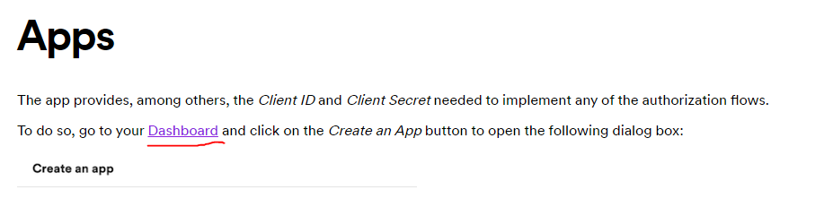

# Performance Portafolio
Performance Testing with Jmeter Scripts
All scripts have to be saved under "scripts" folder
___

1. Requirement.- create a basic script using JMeter to hit the following API about Jokes: 

  https://official-joke-api.appspot.com/random_joke
2. Requirement.- create a basic script that use query parameters in the URL for the cat facts endpoint, use the follwing swagger documentation: 

  https://catfact.ninja/#/Facts
3. Requierment.- create a basic script that hits 5 different endpoints using query parameters for the Bored API using the following API documentation:

  https://www.boredapi.com/documentation
4. Requirement.- Create a JMeter script that is able to request all the US (Unated State) holidays for the year 2022. To do this use the following page: 

https://calendarific.com/api-documentation 

You will need to create an account on this page and get an API Key, so click on Sign UP create an account and go to the url: 

https://calendarific.com/account 

Once there copy the API Key in the API Access Details section:

Then use this API Key as explained in the official documentation described above.
5. Requirement.- Create a JMeter based on the Postman file to get the tracks of spotify. You can get the Postman project from [This file](postman/Spotify.postman_collection.json) 

In order to be able to do the request you will need the following dependencies:
- Create or already have an existing Spotify Account (Free is ok)
- Go to [this link](https://developer.spotify.com/documentation/web-api/concepts/apps) and click on dasbhoard (make sure you are logged in spotify first)

- In the next screen click on **Create App** 
- Fill the main details of the application name and description fields can be as you want. But make sure you fill in the same way the refresh uri 
- Go to the Settings section:

- Copy the CLIENT ID and Client Secret
- Finally use this information in the Post call in your postman collection in the authentication part. 