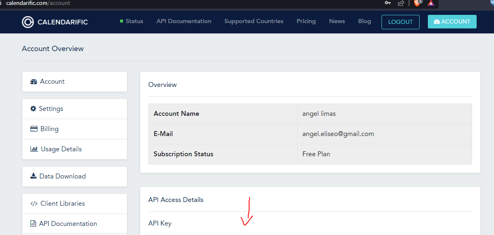

# Performance Portafolio
Performance Testing with Jmeter Scripts
All scripts have to be saved under "scripts" folder
___

1. Requirement.- create a basic script using JMeter to hit the following API about Jokes: 

  https://official-joke-api.appspot.com/random_joke
2. Requirement.- create a basic script that use query parameters in the URL for the cat facts endpoint, use the follwing swagger documentation: 

  https://catfact.ninja/#/Facts
3. Requierment.- create a basic script that hits 5 different endpoints using query parameters for the Bored API using the following API documentation:

  https://www.boredapi.com/documentation
4. Requirement.- Create a JMeter script that is able to request all the US (Unated State) holidays for the year 2022. To do this use the following page: 

https://calendarific.com/api-documentation 

You will need to create an account on this page and get an API Key, so click on Sign UP create an account and go to the url: 

https://calendarific.com/account 

Once there copy the API Key in the API Access Details section:

Then use this API Key as explained in the official documentation described above.